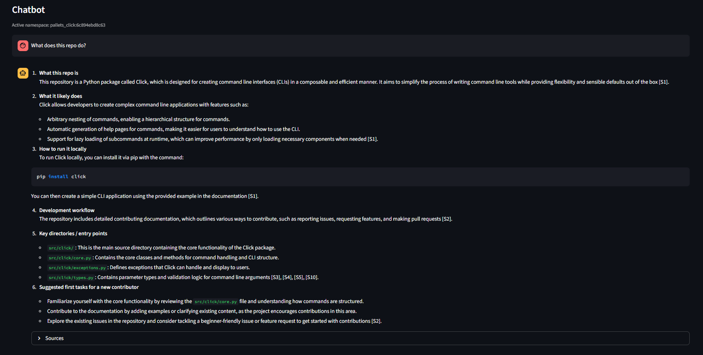

# GitHub Onboarding Agent

A full-stack AI application that ingests GitHub repositories and provides a grounded onboarding chatbot for new contributors.

The system clones a repository, parses and chunks source files, embeds them into a vector database, and enables semantic search and question answering over the codebase. It is designed to work even when a repository has little or no documentation by inferring purpose and structure directly from source code.


---
## Images


---


---



---

## Features

- Repository ingestion via GitHub URL  
- Automatic cloning and deterministic updates  
- Language-agnostic source parsing and chunking  
- Dense vector search using Pinecone  
- Code-aware embeddings via Hugging Face  
- Retrieval-augmented responses with citations  
- Multi-repo support using per-commit namespaces  
- Interactive Streamlit frontend  
- FastAPI backend with LangGraph orchestration  
- Designed to function without README files  

---

## Architecture Overview

### Frontend
- Streamlit
- Handles repository ingestion and interactive chat
- Maintains per-repository chat sessions

### Backend
- FastAPI REST API
- LangGraph for retrieval → answer orchestration
- GitPython for cloning and updates
- Hugging Face for embeddings
- Pinecone for vector storage

### Data Flow

1. User submits a GitHub repository URL  
2. Backend clones or updates the repository  
3. Files are parsed, chunked, and embedded  
4. Vectors are stored in Pinecone under a commit-scoped namespace  
5. User questions are embedded and matched against stored vectors  
6. Responses are generated strictly from retrieved code context  

---

## Tech Stack

- Python 3.11+
- FastAPI
- Streamlit
- LangChain
- LangGraph
- Pinecone
- Hugging Face (Embeddings)
- GitPython
- Gunicorn + Uvicorn

---

## Project Structure

```text
github-onboarding-agent/
├── backend/
│   └── app/
│       ├── main.py
│       ├── config.py
│       ├── routers/
│       │   ├── ingest.py
│       │   └── chat.py
│       ├── services/
│       │   ├── github_loader.py
│       │   ├── chunker.py
│       │   ├── embeddings.py
│       │   ├── pinecone_store.py
│       │   ├── graph.py
│       │   └── openai_llm.py
│       └── models/
│           └── schemas.py
├── streamlit_app.py
├── requirements.txt
└── README.md
```


## Setup and Installation
1. Clone the Repository
```text
git clone https://github.com/your-username/github-onboarding-agent.git
cd github-onboarding-agent
```
2. Create a Virtual Environment
```text
python -m venv venv
source venv/bin/activate
# Windows: venv\Scripts\activate
```

3. Install Dependencies
```text
pip install -r requirements.txt
```

## Environment Variables

Create a .env file in the project root:
```text
PINECONE_API_KEY=your_pinecone_key
PINECONE_INDEX=github-onboarding
HF_EMBED_MODEL=sentence-transformers/all-MiniLM-L6-v2
REPOS_DIR=.repos
OPENAI_API_KEY=optional_for_llm_answers
OPENAI_MODEL=gpt-4o-mini
```

## Notes
- Hugging Face embeddings do not require a token for public models
- OpenAI is optional; the app works in retrieval-only mode without it


## Running Locally
Start Backend (FastAPI)
```text
uvicorn backend.app.main:app --reload --port 8000
```

Backend will be available at:
```text
http://127.0.0.1:8000
```
Start Frontend (Streamlit)
```text
streamlit run streamlit_app.py
```
Frontend will be available at:
```text
http://localhost:8501
```
## Usage
1. Paste a GitHub repository URL into the sidebar
2. Click Ingest
3. Wait for cloning, embedding, and indexing to complete
4. Ask questions about the repository

## Example Questions
- What does this repo do?
- What are the main entry points?
- How is the project structured?
- What are good first tasks for a new contributor?
- Each ingestion creates a new namespace tied to the commit hash, ensuring isolation between repositories.

## Design Decisions
- Namespaces are commit-scoped to prevent cross-repository contamination
- README files are optional; source code is the primary ground truth
- Chunk metadata stores snippet text for grounded answers
- Chat state resets automatically when switching repositories
## Limitations and Future Improvements
- Incremental re-ingestion instead of re-embedding everything
- Language-specific parsing heuristics
- Repository summaries cached per namespace
- Graph-based dependency reasoning
- Authentication and multi-user support

## License

MIT License
